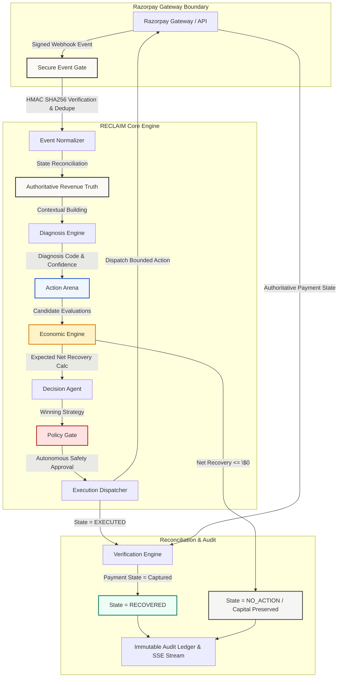
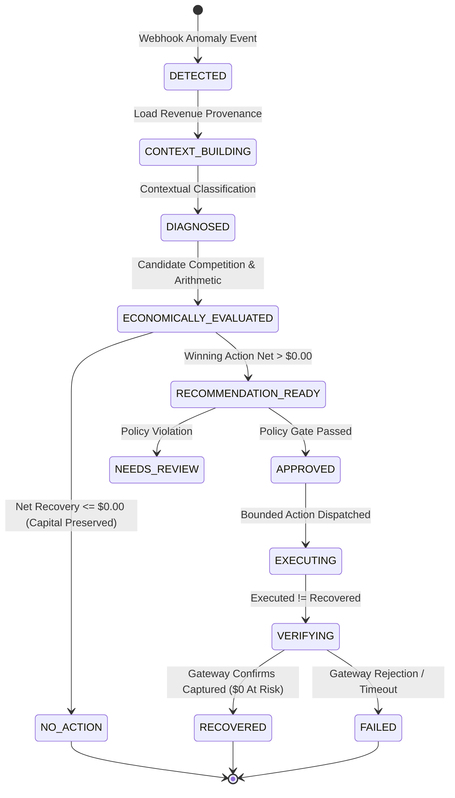

# RECLAIM
### Revenue Evaluation, Contextual Logic & Intelligent Monetary Recovery

> **Recover revenue only when the economics justify it.**

*Razorpay AI Builder 2026 — Track 03: AI Revenue Recovery*

---

## 1. What RECLAIM Is

**RECLAIM** is an autonomous, policy-bounded merchant revenue recovery decision engine built for digital commerce. When payment anomalies occur—such as stale authorizations, gateway timeouts, bank network glitches, or checkout drops—traditional systems fire blind, uncoordinated retries that burn transaction fees, trigger chargeback penalties, and alienate customers.

RECLAIM fundamentally changes this model. It establishes **authoritative revenue truth**, classifies payment failure context, evaluates competing candidate recovery strategies through a **rigorous economic formula**, applies **policy safety constraints**, dispatches bounded interventions, and **authoritatively verifies gateway outcomes** before recognizing recovered capital.

RECLAIM is **not** a passive analytics dashboard, a generic retry script, or an unconstrained LLM chatbot. It is a financial decision system designed to make bounded, audit-verifiable interventions while preserving merchant capital when recovery is economically unviable (**`NO_ACTION`**).

---

## 2. The Problem

Merchant payment loss rarely arrives as a single obvious failure. It manifests across complex operational edge cases:

| Failure Type | Operational Reality | Risk of Naive Intervention |
| :--- | :--- | :--- |
| **Stale Authorization** | Credit card authorization holds expire silently past gateway deadlines (e.g. 7 days). | Blind capture calls fail with gateway authorization errors, incurring processor rejection fees. |
| **Gateway Timeout** | Temporary network glitches reject valid customer charges. | Indiscriminate retries cause chargebacks, duplicate customer charges, and processor flags. |
| **Checkout Abandonment** | Orders created with authorized intent left uncompleted at payment step. | High outreach cost can exceed expected order margin for low-LTV customers. |
| **Unviable Recovery** | Small-value order failure (\$47.00) with high fixed outreach/intervention fees (\$50.00). | Chasing the revenue results in a net financial loss for the merchant. |

Traditional recovery tools ask: *"Can we retry this charge?"*  
RECLAIM asks: **"Is this revenue worth recovering, which intervention strategy yields the highest net return, does policy permit execution, and has the money authoritatively landed?"**

---

## 3. The RECLAIM Thesis

```
 ┌──────────────────────┐      ┌──────────────────────┐      ┌──────────────────────┐
 │   REVENUE TRUTH      │ ───► │  ECONOMIC DECISION   │ ───► │    POLICY SAFETY     │
 │  Authoritative State │      │ Net Recovery > \$0.00 │      │  Bounded Autonomy    │
 └──────────────────────┘      └──────────────────────┘      └──────────────────────┘
                                                                        │
 ┌──────────────────────┐      ┌──────────────────────┐                 │
 │  VERIFIED RECOVERY   │ ◄─── │ EXECUTED != RECOVERED│ ◄───────────────┘
 │  Provider Confirmed  │      │ Bounded Intervention │
 └──────────────────────┘      └──────────────────────┘
```

1. **Revenue Truth Before Action**: Never act on raw, unverified event logs. Establish order and payment provenance first.
2. **Economics Before Intervention**: Evaluate competing candidate strategies mathematically. If expected net recovery $\le 0.00$, deliberately halt execution (**`NO_ACTION`**).
3. **Policy Before Execution**: Validate every economically viable action against context freshness, merchant budget caps, and autonomous safety bounds.
4. **Verification Before Recovery**: Treat execution dispatch as `EXECUTED`, leaving revenue exposed until gateway reconciliation authoritatively confirms `RECOVERED`.
5. **Evidence Before Claims**: Record every decision step, candidate evaluation, policy check, and state transition in an immutable audit ledger.

---

## 4. Track 03 Alignment

| Track Requirement | RECLAIM Implementation | Source Evidence / Location |
| :--- | :--- | :--- |
| **Contextual Failure Diagnosis** | Classifies anomalies into `AUTHORIZATION_STALE`, `GATEWAY_TIMEOUT`, `CHECKOUT_ABANDONED` with confidence ratings. | [`apps/api/app/domain/diagnosis.py`](apps/api/app/domain/diagnosis.py) |
| **Multi-Strategy Action Competition** | Generates and evaluates candidate actions (`attempt_capture_retry`, `manual_review`, `collect_evidence`, `notify_customer`). | [`apps/api/app/domain/actions.py`](apps/api/app/domain/actions.py) |
| **Economic Net Recovery Model** | Computes $\text{Net} = (\text{Recoverable} \times P_{\text{success}}) - \text{Cost}$. Halts if net $\le 0$. | [`apps/api/app/domain/economics.py`](apps/api/app/domain/economics.py) |
| **Policy & Autonomous Safety** | Bounded policy gate verifies context freshness (v1), merchant budget caps, and contact fatigue. | [`apps/api/app/domain/policy.py`](apps/api/app/domain/policy.py) |
| **Authoritative Gateway Verification** | Reconciliation engine updates status to `RECOVERED` only upon gateway webhook confirmation. | [`apps/api/app/events/reconciler.py`](apps/api/app/events/reconciler.py) |
| **Visual Operating Model & Replay** | Interactive 10-node spatial decision graph, moving case token, Action Arena, and step-by-step decision replay. | [`apps/web/components/EngineView.tsx`](apps/web/components/EngineView.tsx) |

---

## 5. Product Walkthrough

```
PUBLIC              AUTHENTICATED APP
[ / ] Landing ───► [/signin | /signup] ───► [/operations] Executive Control Room
                                                   │
                                                   ├─► [/cases] Authoritative Explorer
                                                   │
                                                   ├─► [/engine] Visual Decision Machine
                                                   │
                                                   └─► [/account] Operator & Merchant Context
```

* **Landing Page (`/`)**: Establishes brand visual identity (**Warm Financial Editorial**) with interactive **Economic Test Calculator** and **Visual Operating Model Preview**.
* **Operations Console (`/operations`)**: Executive operational awareness surface displaying real-time aggregates (*Revenue at Risk*, *Expected Net Recovery*, *Verified Recovered*, *Capital Preserved*), Decision Mix counts, Needs Attention queue, and Outcome Summary.
* **Cases Explorer (`/cases`)**: Authoritative exploration register allowing merchants to search (customer, order, payment ID, case ID), filter by status (`All`, `At Risk`, `Verifying`, `Recovered`, `No Action`, `Failed`), and sort by newest or amount at risk.
* **Visual Decision Engine (`/engine`)**: Flagship interactive operating model featuring a connected spatial system map, tangible moving case token, Action Arena candidate competition, net recovery arithmetic, and decision replay.
* **Case Decision Experience (Detail View)**: 8-part decision spine displaying Money, Diagnosis, Economics, Decision, Policy Gate, Lifecycle Map, and Immutable Audit Ledger.

---

## 6. Architecture & Data Flow



---

## 7. Decision Lifecycle State Machine



---

## 8. Revenue Truth & Calculations

RECLAIM establishes authoritative revenue numbers before evaluating actions ([`apps/api/app/domain/revenue_truth.py`](apps/api/app/domain/revenue_truth.py)):

* **Expected Amount ($A_{\text{expected}}$)**: Total order intent amount recorded at checkout.
* **Captured Amount ($A_{\text{captured}}$)**: Authoritatively settled gateway funds.
* **Recoverable Amount ($A_{\text{recoverable}}$)**: Current financial exposure:
  $$A_{\text{recoverable}} = A_{\text{expected}} - A_{\text{captured}}$$
* **Current Risk Exposure**: Reduced to **`\$0.00`** only when $A_{\text{captured}} = A_{\text{expected}}$ (`RECOVERED`).

---

## 9. Economic Decisioning Formula

For each candidate action $a \in \mathcal{A}$, RECLAIM computes ([`apps/api/app/domain/economics.py`](apps/api/app/domain/economics.py)):

$$\text{Expected Gross Recovery}(a) = A_{\text{recoverable}} \times P(\text{success} \mid \text{context}, a)$$

$$\text{Expected Net Recovery}(a) = \text{Expected Gross Recovery}(a) - C(\text{intervention}, a)$$

$$
\text{Winning Strategy } a^* = \max_{a \in \mathcal{A}} \left[ \text{Expected Net Recovery}(a) \right]
$$

$$
\text{Decision} =
\begin{cases}
a^* & \text{if Expected Net Recovery}(a^*) > 0 \text{ and } a^* \text{ is eligible} \\
\text{NO\_ACTION} & \text{otherwise}
\end{cases}
$$

---

## 10. Why `NO_ACTION` Matters (Capital Preservation)

In a representative small-value failure scenario (\$47.00 recoverable amount):
* **Attempt Capture Retry**: Cost = \$0.50, Probability = 0.65 → Expected Net = \$30.05 - \$50.00 = -\$19.95.
* **Manual Review**: Cost = \$15.00, Probability = 0.40 → Expected Net = \$18.80 - \$15.00 = +\$3.80 (Ineligible/Low).
* **Outreach Email**: Cost = \$0.10, Probability = 0.05 → Expected Net = \$2.35 - \$0.10 = +\$2.25.
* **Result**: Because all candidates yield $\le 0.00$ net return or fall below policy thresholds, RECLAIM selects **`NO_ACTION`**.

RECLAIM displays: `SYSTEM STOPPED // INTENTIONAL NO_ACTION — Capital Preserved: \$47.00`.

---

## 11. Safety & Autonomous Policy Guardrails

RECLAIM enforces five safety layers ([`apps/api/app/domain/policy.py`](apps/api/app/domain/policy.py)):

1. **Context Version Guard**: Rejects decisions evaluated against stale context versions (`context_version` mismatch).
2. **Merchant Autonomous Budget Cap**: Prevents intervention expenditure from exceeding merchant monthly caps.
3. **Contact Fatigue Limits**: Restricts customer outreach interventions to 1 attempt per 24 hours.
4. **Candidate Eligibility Gate**: Rules out actions whose contextual preconditions are unsatisfied.
5. **Execution Separation**: Enforces `EXECUTED` $\neq$ `RECOVERED` state boundaries.

---

## 12. Razorpay Integration Boundary, Webhook Security & Idempotency

RECLAIM clearly defines its gateway integration boundary:

### **Integration Implementation Scope**
* **IMPLEMENTED & VERIFIED**:
  * Razorpay webhook signature verification (`X-Razorpay-Signature`)
  * Raw-body HMAC SHA256 verification intercepting request bytes before JSON parsing ([`apps/api/app/api/webhooks.py`](apps/api/app/api/webhooks.py))
  * Database event deduplication on `(merchant_id, provider_event_id)`
  * Gateway event normalization (`payment.failed`, `payment.authorized`, `payment.captured`, `order.paid`)
  * Authoritative payment state reconciliation
  * Razorpay provider adapter boundary ([`apps/api/app/domain/adapters/razorpay.py`](apps/api/app/domain/adapters/razorpay.py))
* **NOT LIVE BY DEFAULT**:
  * Production automated capture execution against real bank networks
  * Production gateway credentials
  * Live external recovery execution against real customer accounts

### **Idempotency & Event Rules**
* **HMAC SHA256 Signature Verification**: Intercepts raw request bytes (`request.body()`) before JSON parsing to verify `X-Razorpay-Signature` against `RAZORPAY_WEBHOOK_SECRET`.
* **Event Deduplication**: Database unique index on `(merchant_id, provider_event_id)` prevents duplicate webhook processing.
* **Showcase Batch Idempotency**: `POST /api/demo/batch` accepts `batch_run_id`; repeated requests with the same batch ID return existing cases without duplicating historical records.

---

## 13. Showcase Batch Scenarios

The showcase batch runner ([`apps/api/app/api/demo.py`](apps/api/app/api/demo.py)) generates 6 deterministic representative cases:

| # | Scenario Name | Amount | Initial Status | Final Status | Key Demonstration |
| :--- | :--- | :--- | :--- | :--- | :--- |
| 1 | `auth_stale_verifying` | \$249.00 | `VERIFYING` | `VERIFYING` | Active gateway reconciliation awaiting capture event. |
| 2 | `auth_stale_recovered` | \$1,499.00 | `VERIFYING` | `RECOVERED` | Capture simulation transitions risk exposure to \$0.00 in emerald. |
| 3 | `payment_failure_notify` | \$320.00 | `RECOMMENDATION_READY` | `RECOMMENDATION_READY` | Candidate competition selects customer payment update notification. |
| 4 | `checkout_abandonment` | \$780.00 | `RECOMMENDATION_READY` | `RECOMMENDATION_READY` | Evaluates abandoned cart recovery email outreach. |
| 5 | `economically_unjustified` | \$47.00 | `NO_ACTION` | `NO_ACTION` | Graph halts at Economic Gate; preserves \$47.00 merchant capital. |
| 6 | `auth_stale_recovered_small` | \$89.00 | `VERIFYING` | `RECOVERED` | Small-value authorization capture recovery verification. |

---

## 14. Verification & Test Strategy

RECLAIM features **185 collected and passing backend tests** (`PYTHONPATH=. .venv/bin/pytest tests/` + `PYTHONPATH=. .venv/bin/python scripts/test_app_flows.py`):

```
185 passed, 0 failed, 0 skipped, 0 warnings
```

### **Test File Inventory**:
* `tests/test_actions.py` (7 tests): Action candidate generation & eligibility ranking
* `tests/test_auth.py` (8 tests): Password hashing, session tokens, login/signup API & merchant isolation
* `tests/test_decision.py` (10 tests): Economic decision formula, gross vs net recovery, `NO_ACTION` selection
* `tests/test_decision_agent.py` (10 tests): LangGraph decision agent transitions & state pipeline execution
* `tests/test_demo_scenario_api.py` (8 tests): Showcase scenario runner, batch idempotency & state verification
* `tests/test_diagnosis.py` (13 tests): Contextual failure classification, stale auth detection & confidence ratings
* `tests/test_economics.py` (9 tests): Net recovery arithmetic, probability weighting & friction cost deduction
* `tests/test_execution.py` (8 tests): Bounded action dispatch, execution idempotency & status transitions
* `tests/test_executive_summary.py` (5 tests): Executive summary formatting & contextual explanation synthesis
* `tests/test_policy.py` (14 tests): Context version freshness, autonomous budget caps & contact fatigue guardrails
* `tests/test_probability.py` (9 tests): Contextual probability estimations & heuristic bound assertions
* `tests/test_razorpay_adapter.py` (5 tests): Provider adapter protocol conformance & disabled mode bounds
* `tests/test_razorpay_normalizer.py` (10 tests): Gateway payload mapping & webhook event normalization
* `tests/test_razorpay_webhook.py` (5 tests): Webhook signature verification & missing header handling
* `tests/test_razorpay_webhook_processing.py` (5 tests): End-to-end webhook processing & state reconciliation
* `tests/test_reconciler.py` (10 tests): Gateway capture reconciliation & order status updates
* `tests/test_recovery_cases_api.py` (4 tests): Cases explorer API, detail view snapshots & error handling
* `tests/test_recovery_overview.py` (5 tests): Portfolio aggregate calculations (*Revenue at Risk*, *Recovered*, *Capital Preserved*)
* `tests/test_recovery_persistence.py` (5 tests): Case persistence, state event appending & concurrency control
* `tests/test_recovery_pipeline.py` (8 tests): Pipeline orchestrator, context building & 2-step verification loop
* `tests/test_revenue_truth.py` (12 tests): Expected vs captured accounting, recoverable exposure & currency rules
* `tests/test_sse_stream_api.py` (3 tests): Real-time SSE streaming, cursor resuming & terminal event handling
* `tests/test_verification.py` (6 tests): Verification engine, `EXECUTED` vs `RECOVERED` state boundaries
* `scripts/test_app_flows.py` (6 E2E flow tests): Full end-to-end FastAPI application state flow execution script

---

## 15. Honest AI / ML Disclosure

* **Orchestration**: LangGraph state machines orchestrate diagnosis, evaluation, policy checks, and execution.
* **Deterministic Baseline**: Probability estimations, diagnosis classification, and cost calculations currently run on a deterministic v1 rules engine for 100% auditability and zero decision hallucination.
* **Presentation LLM**: Presentation-layer executive summaries format context for operator review.
* **What We Do NOT Claim**: We do NOT claim an unconstrained LLM directly initiating unverified bank wire transfers.

---

## 16. Known Limitations & Production Roadmap

### **Current Limitations**
1. **Deterministic Heuristic Probabilities**: Success probabilities are currently computed via rules-based heuristics rather than trained ML models.
2. **Synchronous Pipeline Execution**: Recovery pipeline steps execute synchronously within FastAPI request tasks.
3. **Single-Merchant Currency Display**: Aggregates render in the merchant's target currency without real-time multi-currency FX conversion.

### **Production Evolution Roadmap**
* **v2 ML Probability Engine**: Train gradient-boosted decision trees on historical gateway settlement data to estimate $P(\text{success} \mid \text{context}, a)$.
* **Celery / Redis Worker Queues**: Offload webhook processing and retry execution to asynchronous distributed task queues.
* **Live Razorpay Webhook Subscriptions**: Connect production Razorpay API credentials for live webhooks and automated capture execution.

---

## 17. Quick Start Guide

### **1. Prerequisites**
* Python 3.13+
* Node.js 20+
* PostgreSQL 16+ (Database `reclaim` running on `localhost:5432`)

### **2. Backend Setup (`apps/api`)**
```bash
cd apps/api

# Create & activate virtual environment
python3 -m venv .venv
source .venv/bin/activate

# Install dependencies
pip install -r requirements.txt

# Run database migrations
.venv/bin/alembic upgrade head

# Start FastAPI application
.venv/bin/uvicorn app.main:app --reload --port 8000
```

### **3. Frontend Setup (`apps/web`)**
```bash
cd apps/web

# Install dependencies
npm install

# Build Next.js application
npm run build

# Start Next.js development server
npm run dev
```

### **4. Run Tests & Validation Tooling**
```bash
# Backend test suite (185 tests)
cd apps/api
PYTHONPATH=. .venv/bin/pytest -q

# Run end-to-end flow validation script
PYTHONPATH=. .venv/bin/python scripts/test_app_flows.py

# Frontend build & TypeScript check
cd apps/web
npm run build
npx tsc --noEmit
```

---

## 18. Project Structure

```
RECLAIM-AI-Revenue-Recovery-Foundation/
├── README.md                          # Master Technical Overview & Walkthrough
├── .gitignore                         # Comprehensive secret & artifact exclusions
├── .env.example                       # Safe environment variable template
├── docs/                              # Deep Technical Architecture & Evidence Docs
│   ├── ARCHITECTURE.md                # System Architecture & State Machine
│   ├── DECISION_ENGINE.md             # Decision Engine & Action Competition
│   ├── REVENUE_TRUTH.md               # Authoritative Revenue Mathematics
│   ├── SAFETY_AND_POLICY.md           # Guardrails, Budget Caps & Policy Gates
│   ├── WEBHOOKS_AND_IDEMPOTENCY.md    # HMAC Verification & Event Deduplication
│   ├── DEMO_AND_EVIDENCE.md           # Showcase Batch & Judge Demo Playbook
│   ├── TESTING.md                     # Test Philosophy & 185-Test Inventory
│   └── LIMITATIONS_AND_ROADMAP.md     # Known Limitations & Scale Evolution
├── apps/
│   ├── api/                           # FastAPI Backend Service
│   │   ├── app/
│   │   │   ├── agents/                # LangGraph Decision Agent Orchestration
│   │   │   ├── api/                   # REST Routes (auth, recovery, demo, webhooks)
│   │   │   ├── core/                  # Security, Sessions, Settings
│   │   │   ├── db/                    # SQLAlchemy 2.0 Models & Session Setup
│   │   │   ├── domain/                # Core Business Logic (Truth, Economics, Policy)
│   │   │   ├── events/                # Event Gate & Reconciler
│   │   │   └── services/              # Pipeline Processors & Audit Trail
│   │   ├── alembic/                   # Alembic Database Migrations (0001-0006)
│   │   ├── scripts/                   # Validation Scripts (test_app_flows.py)
│   │   └── tests/                     # Pytest Suite (185 items)
│   └── web/                           # Next.js 16 App Router Frontend
│       ├── app/                       # Page Routes (/, /operations, /cases, /engine, /account)
│       ├── components/                # Warm Financial Editorial Components (EngineView, etc.)
│       └── lib/                       # Types, API Fetchers & Presentation Formatters
```

---

*RECLAIM — Built for Razorpay AI Builder 2026 Hackathon (Track 03: AI Revenue Recovery).*
