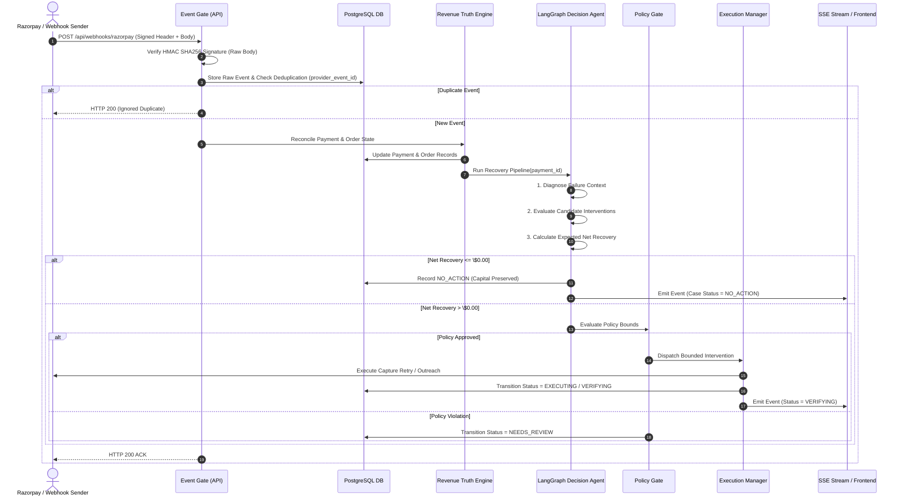
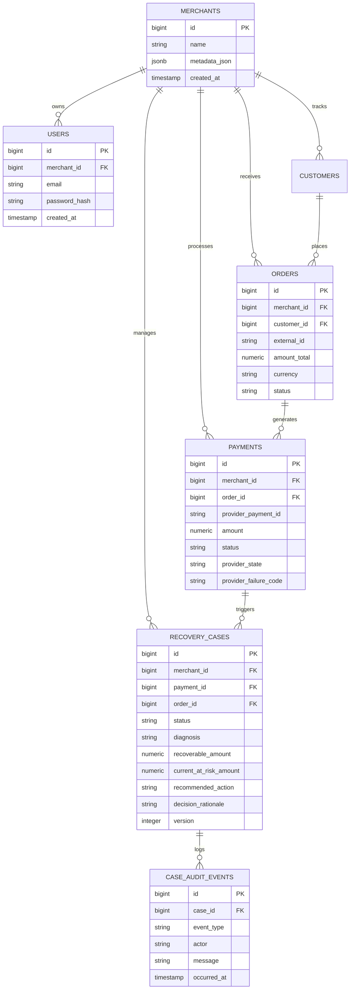
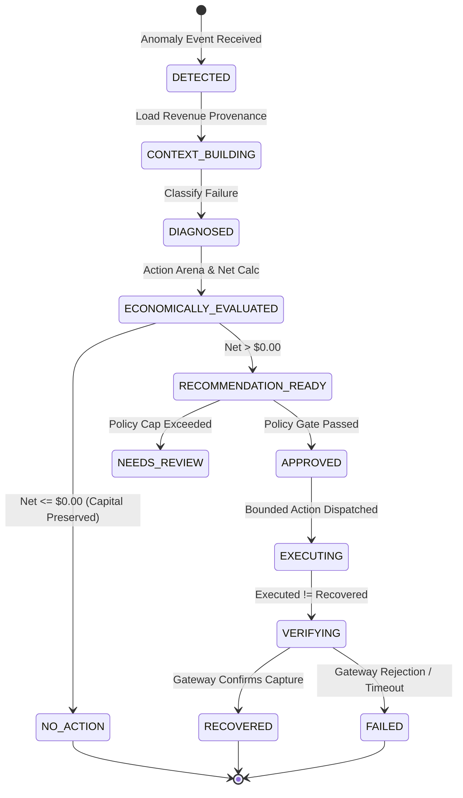

# System Architecture & Technical Design

> **RECLAIM Architecture**: Event-Driven Revenue Reconciliation & Bounded Autonomous Decision Engine

---

## 1. System Overview & Component Responsibilities

RECLAIM is structured into decoupled domain layers ([`apps/api/app/domain`](../apps/api/app/domain)) and API services ([`apps/api/app/api`](../apps/api/app/api)).

```
┌─────────────────────────────────────────────────────────────────────────────┐
│                          PRESENTATION LAYER (Next.js 16)                    │
│   Operations Console  │  Authoritative Explorer  │  Visual Decision Engine  │
└─────────────────────────────────────────────────────────────────────────────┘
                                      │ HTTP / SSE
┌─────────────────────────────────────▼───────────────────────────────────────┐
│                           API & INGESTION LAYER                             │
│   Auth Routes (/api/auth)  │  Webhooks Gate (/api/webhooks/razorpay)        │
│   Overview Read Model      │  Showcase Batch Runner (/api/demo/batch)       │
└─────────────────────────────────────┬───────────────────────────────────────┘
                                      │
┌─────────────────────────────────────▼───────────────────────────────────────┐
│                      REVENUE TRUTH & RECONCILIATION                         │
│   Raw Body Verification   │  Event Deduplication  │  Revenue Truth Engine   │
└─────────────────────────────────────┬───────────────────────────────────────┘
                                      │
┌─────────────────────────────────────▼───────────────────────────────────────┐
│                    BOUNDED AUTONOMOUS DECISION ENGINE                       │
│   Diagnosis Engine  │  Action Arena Competition  │  Net Economic Calculator │
│   LangGraph Agent   │  Policy Safety Gate       │  Execution Manager       │
└─────────────────────────────────────┬───────────────────────────────────────┘
                                      │
┌─────────────────────────────────────▼───────────────────────────────────────┐
│                         PERSISTENCE & RECONCILIATION                        │
│   PostgreSQL Schema (SQLAlchemy 2.0)  │  Immutable Forensic Audit Ledger    │
└─────────────────────────────────────────────────────────────────────────────┘
```

### Component Inventory & Code References:
* **Secure Event Gate** ([`apps/api/app/api/webhooks.py`](../apps/api/app/api/webhooks.py)): Captures raw HTTP request body streams to verify Razorpay HMAC SHA256 signatures before JSON deserialization.
* **Event Reconciler** ([`apps/api/app/events/reconciler.py`](../apps/api/app/events/reconciler.py)): Reconciles out-of-order webhook events and enforces active case uniqueness per payment.
* **Revenue Truth Engine** ([`apps/api/app/domain/revenue_truth.py`](../apps/api/app/domain/revenue_truth.py)): Computes expected order intent, captured funds, and recoverable exposure.
* **Diagnosis Engine** ([`apps/api/app/domain/diagnosis.py`](../apps/api/app/domain/diagnosis.py)): Classifies contextual failures (`AUTHORIZATION_STALE`, `GATEWAY_TIMEOUT`, `CHECKOUT_ABANDONED`).
* **Action Arena & Candidates** ([`apps/api/app/domain/actions.py`](../apps/api/app/domain/actions.py)): Evaluates candidate strategies side-by-side.
* **Economic Engine** ([`apps/api/app/domain/economics.py`](../apps/api/app/domain/economics.py)): Computes Expected Net Recovery ($\text{Net} = A_{\text{recoverable}} \times P - C$).
* **Decision Agent** ([`apps/api/app/agents/decision_agent.py`](../apps/api/app/agents/decision_agent.py)): LangGraph state machine driving decision strategy selection.
* **Policy Engine** ([`apps/api/app/domain/policy.py`](../apps/api/app/domain/policy.py)): Validates decision safety against context freshness and budget caps.
* **Execution Manager** ([`apps/api/app/domain/execution.py`](../apps/api/app/domain/execution.py)): Dispatches provider interventions while maintaining `EXECUTED` state.
* **Verification Engine** ([`apps/api/app/domain/verification.py`](../apps/api/app/domain/verification.py)): Authoritatively confirms payment settlement before transitioning to `RECOVERED`.

---

## 2. Webhook Ingestion & Recovery Sequence



---

## 3. Database Entity-Relationship Model



---

## 4. Lifecycle State Machine Transitions



---

## 5. System Consistency Principles

1. **Active Case Uniqueness**: A payment can have at most one active (non-terminal) recovery case. Concurrency checks lock rows using `FOR UPDATE` or DB unique partial indexes on active states (`VERIFYING`, `EXECUTING`, `APPROVED`).
2. **Optimistic Concurrency Control**: `RecoveryCase` rows include an integer `version` field. Policy evaluations verify that `context_version` matches the case version before execution dispatch.
3. **Immutable Forensic Audit Ledger**: Every decision phase, policy check, state transition, and provider response appends an immutable record to `case_audit_events`.
4. **Merchant Scoping Isolation**: Every API endpoint filters queries strictly by `merchant_id` extracted from the authenticated user's session cookie.

---

## 6. Security Boundaries

* **Webhook Authentication**: Razorpay signature header `X-Razorpay-Signature` checked against HMAC SHA256 digest of raw request bytes.
* **User Authentication**: HTTP-only `reclaim_session` cookie containing encrypted, signed session metadata. Passwords hashed using bcrypt.
* **Zero Secret Exposure**: Tokens and API keys are never rendered in JSON responses or frontend state.

---

*RECLAIM — System Architecture & Technical Design Document.*
