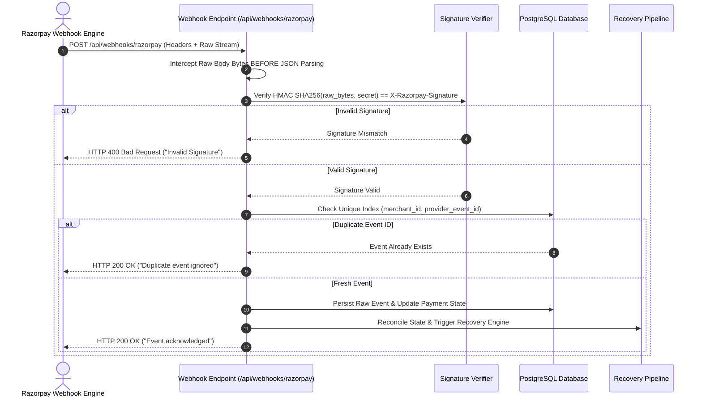

# Webhooks, Ingestion Security & Idempotency

> **RECLAIM Webhook Engine**: HMAC SHA256 Raw-Body Verification, Event Deduplication & Idempotency

---

## 1. Overview

Payment webhooks arrive over un-trusted public networks. RECLAIM implements a secure event gate ([`apps/api/app/api/webhooks.py`](../apps/api/app/api/webhooks.py)) that authenticates webhook payloads, deduplicates events, and reconciles state idempotently.

---

## 2. Webhook Verification Sequence



---

## 3. Why Raw-Body Verification Occurs Before JSON Parsing

A critical security vulnerability in webhook handlers occurs when frameworks parse JSON body strings into dictionary objects before signature verification. White-space variations, key reordering, or numeric formatting changes introduced by JSON deserializers alter the exact byte sequence, rendering valid HMAC signatures un-verifiable.

RECLAIM intercepts the un-parsed byte stream directly from the HTTP request connection:

```python
# Raw-body signature verification pattern in app/api/webhooks.py
raw_body = await request.body()
signature = request.headers.get("X-Razorpay-Signature")

expected_signature = hmac.new(
    key=settings.razorpay_webhook_secret.encode("utf-8"),
    msg=raw_body,
    digestmod=hashlib.sha256
).hexdigest()

if not hmac.compare_digest(expected_signature, signature):
    raise HTTPException(status_code=400, detail="Invalid webhook signature")
```

---

## 4. Deduplication & Idempotency Rules

1. **Event ID Deduplication**: `raw_webhook_events` table enforces a database unique constraint on `(merchant_id, provider_event_id)`.
2. **Payment State Convergence**: Updating payment states uses deterministic transition logic. Re-delivering a `payment.authorized` event after `payment.captured` has been processed will leave the payment in `captured` status.
3. **Showcase Batch Idempotency**: `POST /api/demo/batch` accepts a `batch_run_id` parameter. Repeated requests with the same batch ID check for existing cases by deterministic external IDs (`ord_batch_<id>_1`) and return existing cases without duplicating historical records.

---

*RECLAIM — Webhooks, Ingestion Security & Idempotency.*
